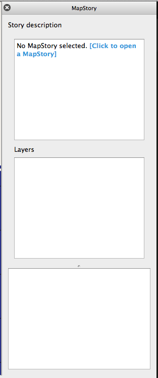
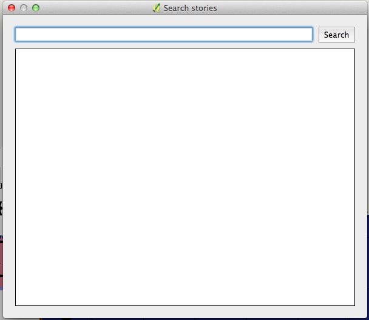
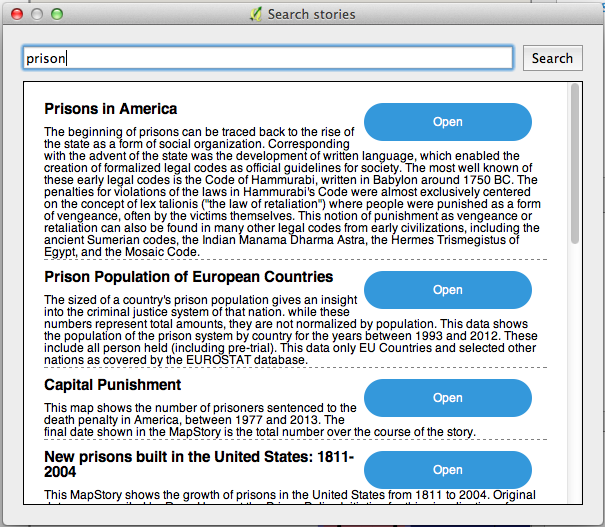
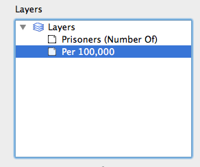
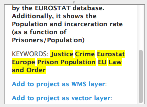

MapStory QGIS plugin
=====================

This plugin allows browsing MapStory maps and layers from QGIS.

The main element of the plugin is the MapStory explorer. Select the *Plugins/MapStory/MapStory explorer* to show it

In the upper panel you will see the information about the currently selected story. The first time you open the explorer, no story will be selected. You can select one by clicking on the *[Click to open a different MapStory]* link. The Story browser will be shown

Type the text string to search and the panel will be populated with the list of available stories that contain your search string.

Click on the *Open* button and the explorer will be updated.

The central panel contains the list of all available layers in the selected story.

When a layer is selected in this panel, its description will appear in the lower panel. At the end of it, below the layer tags, you will find links to add the layer as a WMS or a vector layer.

In both cases, the layer will be added to the project. In the context menu of the layer in the layers list, a *MapStory* menu will appear, with a command to animate the layer using its time information.

.. figure:: animation.png
   :align: center

Clicking on it you will see the animation widget, which you can use to select a given time (and the layer rendering will be adapted accordingly) or to start playing the full animation.

.. figure:: animationwidget.png
   :align: center
